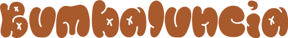

<!-- LOGO PRESENTATION -->
<section id= "top">

  

   

<!-- ACERCA DE ESTE PROYECTO -->
## 🚧 - Acerca de este proyecto
Este a sido un proyecto personal, basado en la idea de crear una web para una marca.

## 🎯 - Lenguajes usados

## 📖 - Organización y Historial
* 1.0
    * Preparación en <b>bloc de notas<b/>

<!-- AGRADECIMIENTOS -->
## 🥇 - Agradecimientos
* <a href="https://chat.openai.com/">ChatGPT</a>

## 🙌 - Sitios de referencia
* <a href="https://www.kelloggs.es/">Kellog's</a>
* <a href="https://empresa.nestle.es/es">Nestle</a>

<!-- LINKS -->
## 🛠️ - Otros proyectos
* <a href="https://github.com/Sailok25/Catarsis">Catarsis</a>
* <a href="Link">...</a>

(<a href="#top">back to top</a>)

